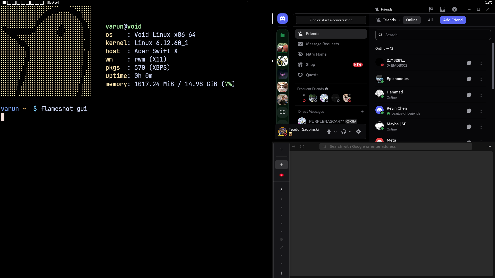

# rwm (Rust Window Manager)

**rwm** is a dynamic, tiling window manager written in **Rust**. It interacts directly with the X Window System using the X11 protocol via the `x11rb` library.

Designed for speed and simplicity, **rwm** communicates directly with the X server without relying on high-level windowing abstractions or frameworks.



## 🚀 Features

* **Dynamic Tiling:** Automatically arranges windows to maximize screen real estate.
* **4 Layout Modes:**
    * **Master/Stack:** The classic "one master, many stack" layout.
    * **Dwindle:** A Fibonacci-like layout with manual split direction control.
    * **Vertical Stack:** All windows split evenly horizontally.
    * **Monocle:** Fullscreen focused window.
* **Configuration System:** Fully configurable keybindings via '~/.config/rwm/rwm.toml'.
* **Interactive Status Bar:** Displays workspaces, active window title, clock, and layout indicator.
* **Workspaces:** 9 virtual desktops with instant, tear-free switching.
* **Rust-Safe Interaction:** Uses `x11rb` for safe, Rust-idiomatic wrappers around the XCB library.

## ⌨️ Controls

**Mod Key:** `Super` (Windows Key)

| Keybinding | Action |
| :--- | :--- |
| **Mod + Enter** | Spawn Terminal (`kitty`) |
| **Mod + P** | Run Launcher (`dmenu`) |
| **Mod + Shift + Enter** | Promote focused window to Master |
| **Mod + Space** | Cycle Layout (Master/Stack -> Vertical -> Dwindle -> Monocle) |
| **Mod + J / K** | Cycle Focus (Next / Previous window) |
| **Mod + Shift + J / K** | Swap Window Up/Down |
| **Mod + B** | Toggle Status Bar |
| **Mod + - / \|** | Switch Split Direction in Dwindle Layout |
| **Mod + 1-9** | Switch to Workspace 1-9 |
| **Mod + Shift + 1-9** | Move active window to Workspace 1-9 |
| **Mod + Shift + Q** | Close the focused window |
| **Mod + Ctrl + Q** | Quit the Window Manager |


## 📦 Prerequisites

To build and run **rwm**, you need:

* **Rust & Cargo** (Latest stable)
* **X11 Development Libraries** (libxcb)
* **Kitty** (Default terminal emulator)
* **dmenu** (Application launcher)

## 🏃‍♂️ How to run rwm

Add the following to your `~/.xinitrc`:

```bash
exec /path/to/target/release/rwm
```

## 🔍 Troubleshooting & Logging

rwm logs debug information to `/tmp/rwm.log`. You can watch this file in real-time to debug issues or see internal state changes: 

```bash
tail -f /tmp/rwm.log
```

## 📄 License

MIT
